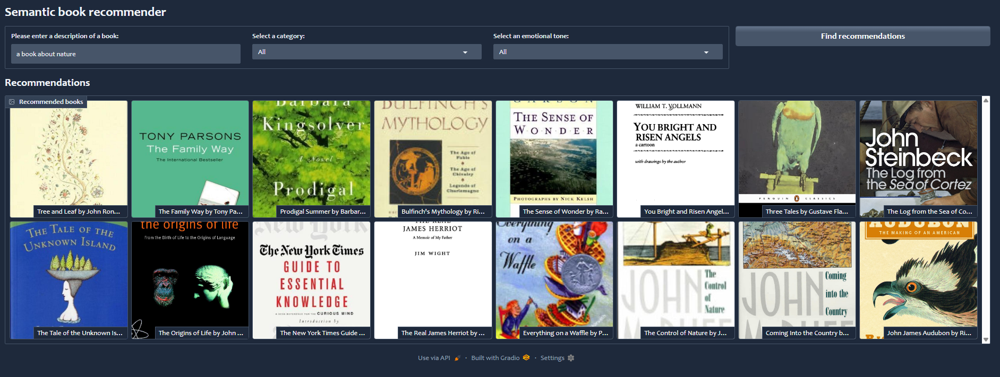
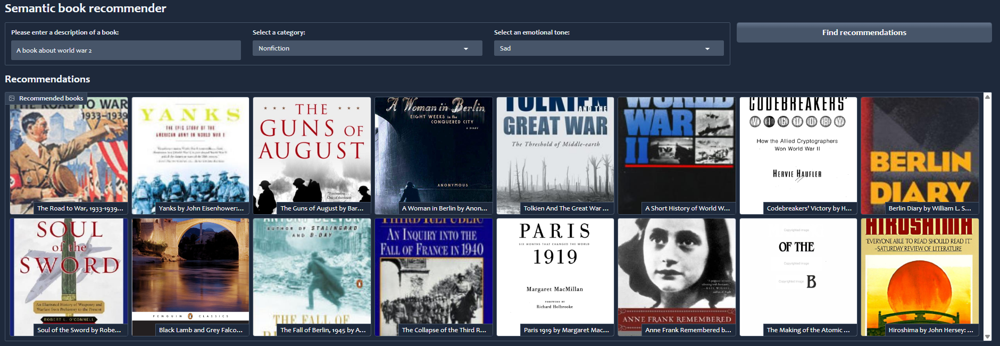

# 📚 AI-Powered Book Discovery Engine

An intelligent book recommendation dashboard that goes beyond simple keyword matching. This system uses **Vector Embeddings** and **Large Language Models (LLMs)** to understand the "vibe," emotional tone, and specific genres of books to find your next perfect read.


## 🌟 Features

- **Semantic Search:** Search for books using natural language.
- **Emotional Tone Filtering:** Filter results by mood—choose "Sad" for a touching memoir or "Happy" for an uplifting children's book.
- **Category Aware:** Intelligent filtering for Non-Fiction, Fiction, and more.
- **Deep Content Understanding:** Powered by OpenAI embeddings to find conceptual matches even if the words don't match exactly.

---

## 📸 Screenshots

### 🌿 Search for Nature
*Finding books about the great outdoors using semantic similarity.*

### 🎭 Tone & Category Filtering
*Combining sadness and historical non-fiction to find World War II books.*

---

## 🛠️ Setup & Installation

### 1. Clone & Environment
First, clone this repository and set up your virtual environment:
```bash
python -m venv .venv
.\.venv\Scripts\activate

### 2. Install all required libraries (LangChain, OpenAI, Gradio, etc.):
pip install -r requirements.txt

### 3. API Keys
Add your OpenAI and HuggingFace API keys in the .env file

### 3.To launch the interactive Gradio dashboard, run:
python gardio-dashboard.py

🧠 What I Learned
This project introduced me to the world of AI and Retrieval-Augmented Generation (RAG):

LangChain: Implementing chains to connect LLMs with private datasets.

Vector Databases: Using ChromaDB to perform similarity searches based on meanings rather than just text.

OpenAI API: Handling embeddings and model completions.

Environment Security: Protecting credentials using .env files.